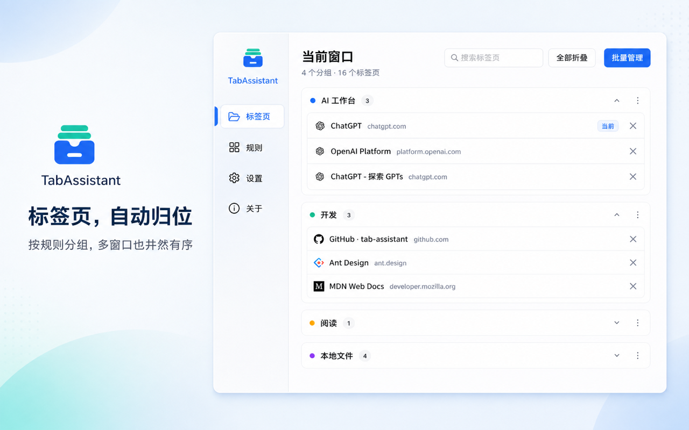
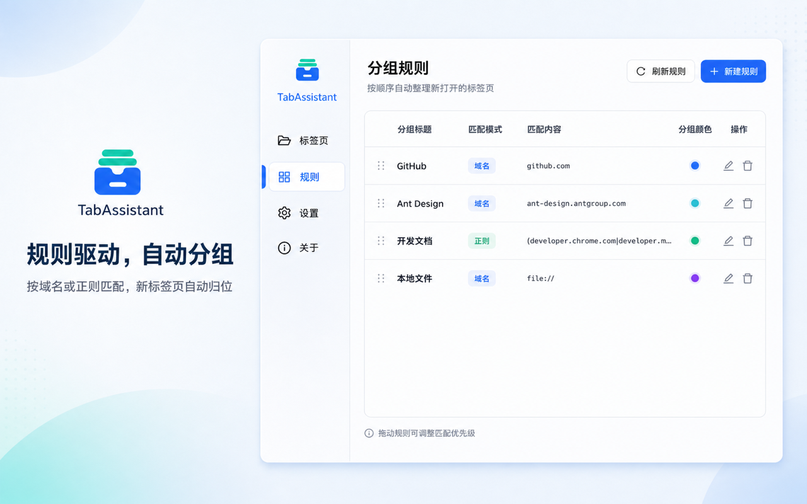
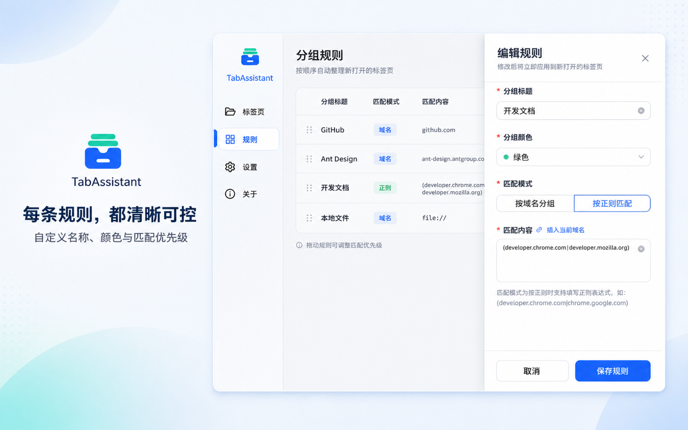
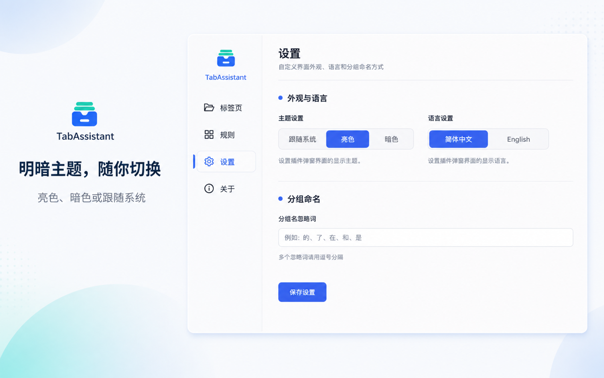

<div align="center">
  
  <h1>TabAssistant</h1>
  <p>让浏览器标签页自动回到秩序</p>
  <p>
    按规则自动分组 · 多窗口独立管理 · 本地运行
  </p>
  <p>
    <a href="https://chromewebstore.google.com/detail/obdaljfdjocbdmpofhncldmfppjeemda">Chrome / Edge 安装</a>
    ·
    <a href="https://github.com/woolson/tab-assistant/issues">问题反馈</a>
    ·
    <a href="./LICENSE">MIT License</a>
  </p>
</div>


## 为什么使用 TabAssistant

标签页一多，找页面、理分组、切窗口都很费时间。

TabAssistant 会按照你设置的规则整理新打开的标签页，让散乱页面自动进入对应分组。你可以在一个界面中搜索、展开、折叠、关闭或恢复标签页，同时让不同浏览器窗口保持各自的整理秩序。

标签整理在浏览器本地完成，不会将浏览记录或标签页内容上传到 TabAssistant 的服务器。规则和设置保存在浏览器扩展存储中，可使用浏览器自身的同步能力。

## 功能亮点

- **规则驱动的自动分组**：支持按域名或正则表达式匹配新标签页。
- **清晰可控的规则管理**：自定义分组名称、颜色和匹配内容，通过拖拽调整优先级。
- **当前窗口批量管理**：搜索标签页，一键展开或折叠分组，批量关闭并恢复误关页面。
- **多窗口独立归位**：每个窗口分别管理，标签页保留在原来的浏览器窗口。
- **本地文件自动归类**：`file://` 页面可自动进入“本地文件”分组。
- **个性化外观**：支持亮色、暗色和跟随系统三种主题。
- **中英文界面**：可在简体中文与 English 之间切换。
- **配置迁移**：支持导入、导出分组规则和插件设置。

## 界面预览

### 当前标签

查看当前窗口中的全部分组和标签页，快速搜索或批量整理。



### 分组规则

用域名或正则表达式定义自动分组规则，并通过拖拽调整匹配顺序。



### 规则编辑

为每条规则设置名称、分组颜色、匹配方式和匹配内容。



### 主题与语言

选择亮色、暗色或跟随系统主题，并切换插件界面语言。



## 安装

### Chrome / Edge

从 [Chrome Web Store](https://chromewebstore.google.com/detail/obdaljfdjocbdmpofhncldmfppjeemda) 安装。Microsoft Edge 同样支持安装 Chrome 扩展。

### 本地开发版本

```bash
npm ci
npm run build
```

然后打开浏览器的扩展管理页面，启用“开发者模式”，选择“加载已解压的扩展”，并加载项目中的 `build` 目录。

## 本地开发

```bash
# 安装依赖
npm ci

# 启动本地开发服务
npm start

# 生成生产构建
npm run build

# 仅构建后台脚本
npm run build:bg
```

项目基于 React、TypeScript、Ant Design 和 Chrome Extension Manifest V3。

## 权限与隐私

TabAssistant 只申请实现标签分组所需的权限：

- `tabs`：读取和管理浏览器标签页。
- `tabGroups`：创建和管理标签页分组。
- `storage`：在浏览器中保存规则、语言、主题等设置。

插件的标签整理逻辑在本地运行，不会将浏览记录或标签页内容上传到 TabAssistant 的服务器。规则和设置保存在浏览器扩展存储中，并可能通过浏览器自身的同步机制在你的设备之间同步。

## 相关文档

- [Chrome Extension Manifest V3](https://developer.chrome.com/docs/extensions/mv3/manifest/)
- [Chrome Tabs API](https://developer.chrome.com/docs/extensions/reference/api/tabs)
- [Chrome Tab Groups API](https://developer.chrome.com/docs/extensions/reference/api/tabGroups)

## License

[MIT](./LICENSE)
