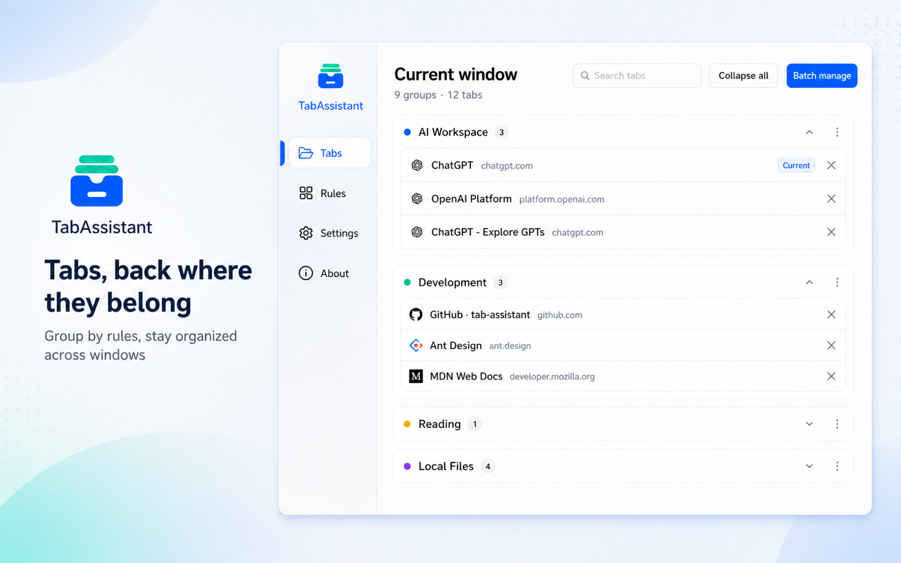
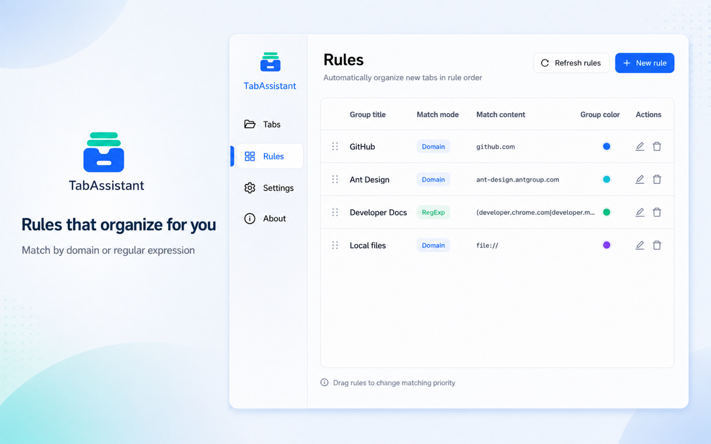
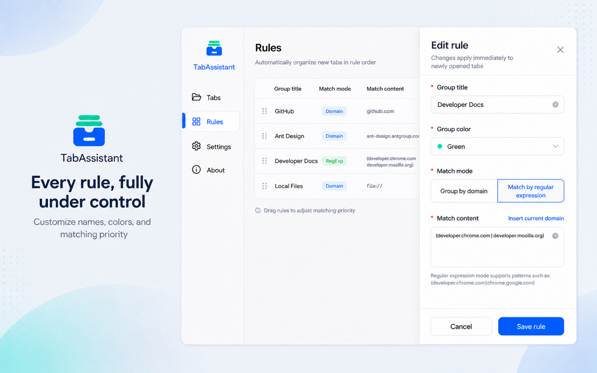
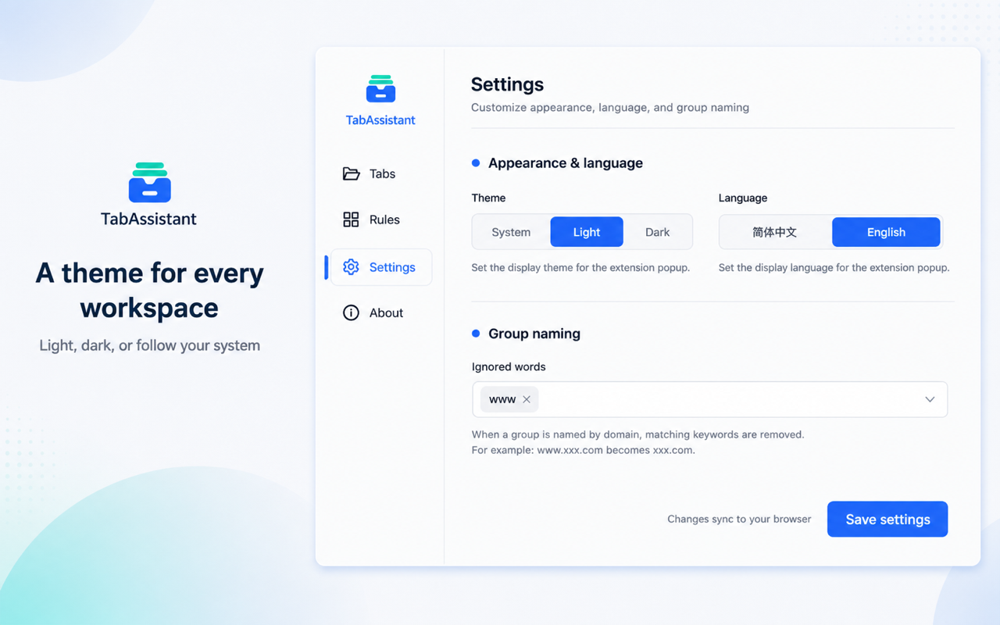

<p align="right">
  English · <a href="./README.zh-CN.md">简体中文</a>
</p>

<div align="center">
  
  <h1>TabAssistant</h1>
  <p>Bring browser tabs back into order</p>
  <p>
    Rule-based auto-grouping · Independent multi-window management · Runs locally
  </p>
  <p>
    <a href="https://chromewebstore.google.com/detail/obdaljfdjocbdmpofhncldmfppjeemda">Install for Chrome / Edge</a>
    ·
    <a href="https://github.com/woolson/tab-assistant/issues">Feedback</a>
    ·
    <a href="./LICENSE">MIT License</a>
  </p>
</div>



## Why TabAssistant?

As tabs pile up, finding pages, organizing groups, and switching between windows all become unnecessarily time-consuming.

TabAssistant organizes newly opened tabs according to your rules, automatically placing scattered pages into the right groups. From one interface, you can search, expand, collapse, close, or restore tabs while keeping every browser window independently organized.

Tab organization happens locally in your browser. TabAssistant does not upload your browsing history or tab contents to its own servers. Rules and preferences are stored in browser extension storage and can use your browser's built-in sync capability.

## Features

- **Rule-based auto-grouping**: Match newly opened tabs by domain or regular expression.
- **Clear, flexible rule management**: Customize group names, colors, and matching patterns, then drag rules to change their priority.
- **Batch management for the current window**: Search tabs, expand or collapse all groups, close multiple tabs, and restore accidentally closed pages.
- **Independent multi-window organization**: Manage every window separately and keep tabs in their original browser window.
- **Automatic local-file grouping**: Place `file://` pages into a dedicated Local Files group.
- **Personalized appearance**: Choose a light theme, dark theme, or follow your system setting.
- **Chinese and English UI**: Switch between Simplified Chinese and English.
- **Configuration migration**: Import and export grouping rules and extension preferences.

## Interface Preview

### Grouping Rules

Define automatic grouping rules with domains or regular expressions, then drag them to adjust matching priority.



### Rule Editor

Configure the name, group color, matching method, and matching content for each rule.



### Theme and Language

Choose light, dark, or system theme and switch the extension's display language.



## Installation

### Chrome / Edge

Install TabAssistant from the [Chrome Web Store](https://chromewebstore.google.com/detail/obdaljfdjocbdmpofhncldmfppjeemda). Microsoft Edge can also install extensions from the Chrome Web Store.

### Local Development Build

```bash
npm ci
npm run build
```

Open your browser's extension management page, enable Developer mode, choose **Load unpacked**, and select the project's `build` directory.

## Development

```bash
# Install dependencies
npm ci

# Start the local development server
npm start

# Create a production build
npm run build

# Build only the background script
npm run build:bg
```

TabAssistant is built with React, TypeScript, Ant Design, and Chrome Extension Manifest V3.

## Permissions and Privacy

TabAssistant requests only the permissions needed to organize browser tabs:

- `tabs`: Read and manage browser tabs.
- `tabGroups`: Create and manage tab groups.
- `storage`: Save rules, language, theme, and other preferences in browser extension storage.

Tab organization runs locally. TabAssistant does not upload your browsing history or tab contents to its own servers. Rules and preferences are stored in browser extension storage and may sync between your devices through your browser's own synchronization mechanism.

## Related Documentation

- [Chrome Extension Manifest V3](https://developer.chrome.com/docs/extensions/mv3/manifest/)
- [Chrome Tabs API](https://developer.chrome.com/docs/extensions/reference/api/tabs)
- [Chrome Tab Groups API](https://developer.chrome.com/docs/extensions/reference/api/tabGroups)

## License

[MIT](./LICENSE)
